# Тестування працездатності системи

Для тестування та документування працездатності API використано інструмент Swagger UI

## Користувачі бази даних

    

## Отримання усіх користувачів методом GET

    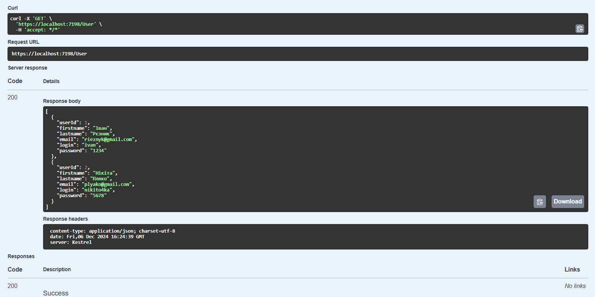

## Створення нового користувача методом POST
### Введення даних для нового користувача

    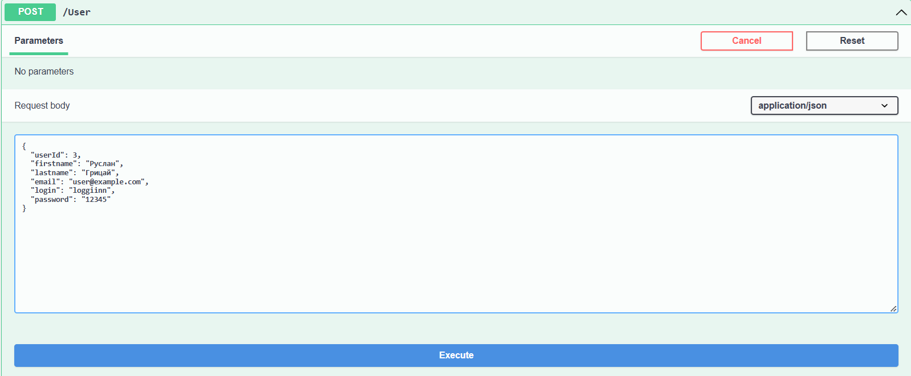

### Успішне додання користувача у базу даних

    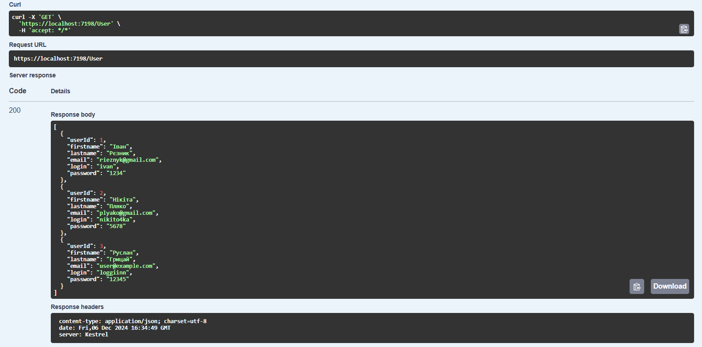

### Спроба додати користувача з однаковим логіном

    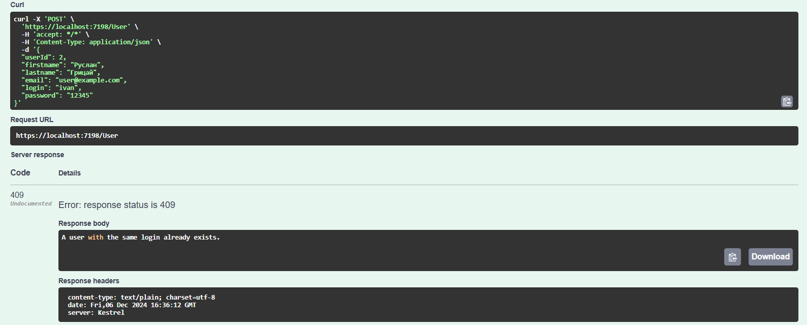

## Пошук користувача за унікальним ідентифікатором
### Пошук користувача за наявним ідентифікатором

    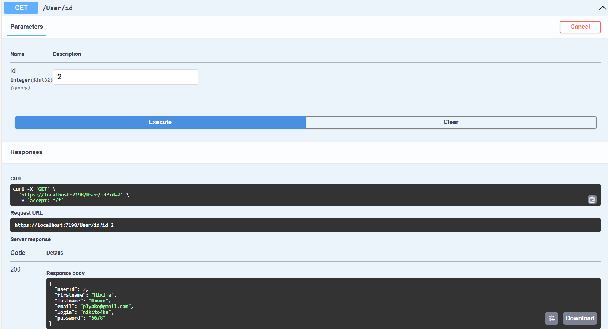

### Пошук користувача за неіснуючим ідентифікатором

    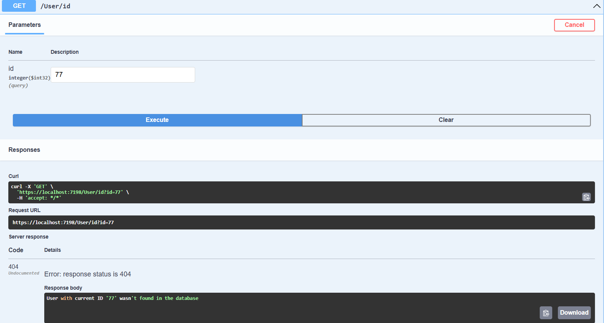

## Оновлення даних корситувача метод PUT
### Введення нових даних для користувача

    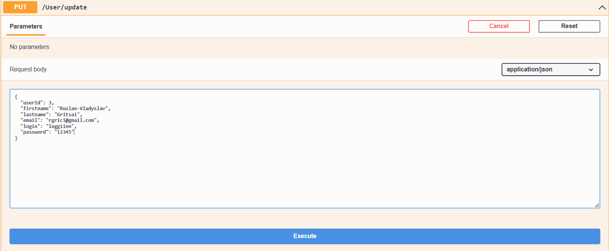

### Успішне виконання методу PUT

    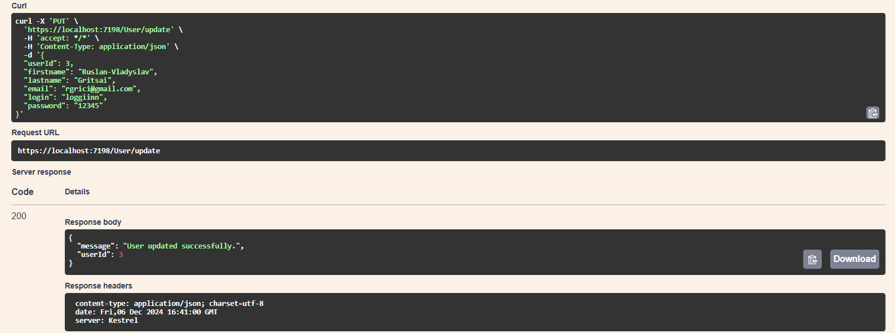

### Наявні користувачі та оновлені дані користувача з ідентифікатором 3

    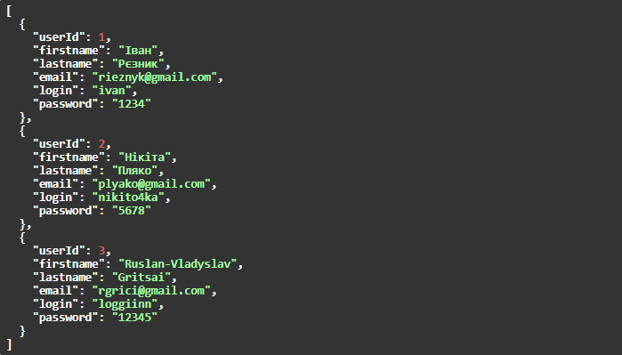

### Спроба оновити дані користувача записавши неправильний формат пошти та залишивши пусте поле

    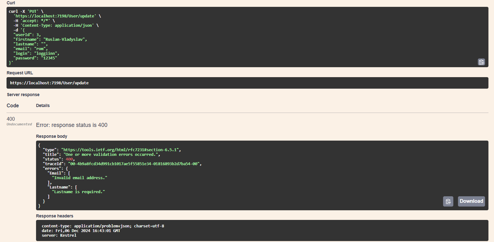

## Видалення користувача за ідентифікатором використовуючи DELETE
### Успішне видалення користувача з бази даних

    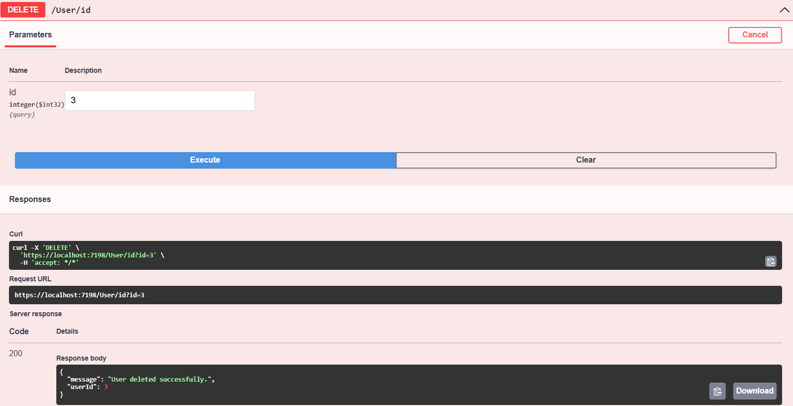

### Спроба видалити користувача за неіснуючим ідентифікатором

    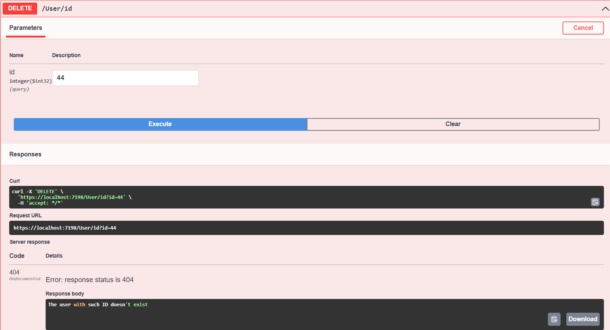

